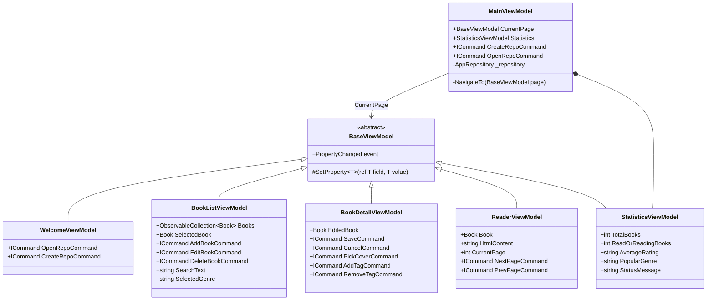
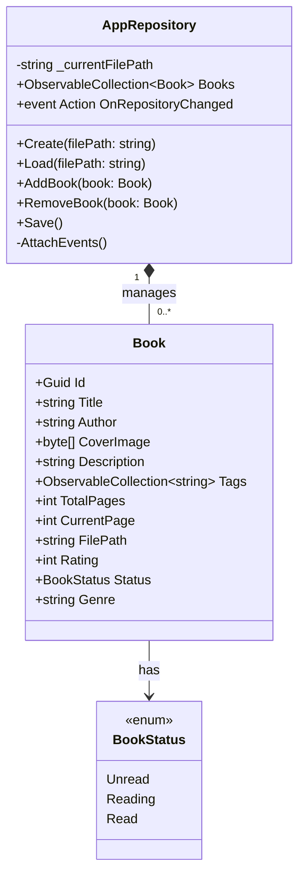
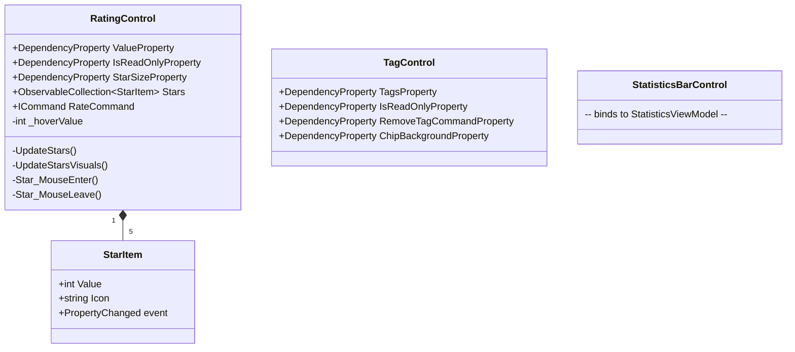
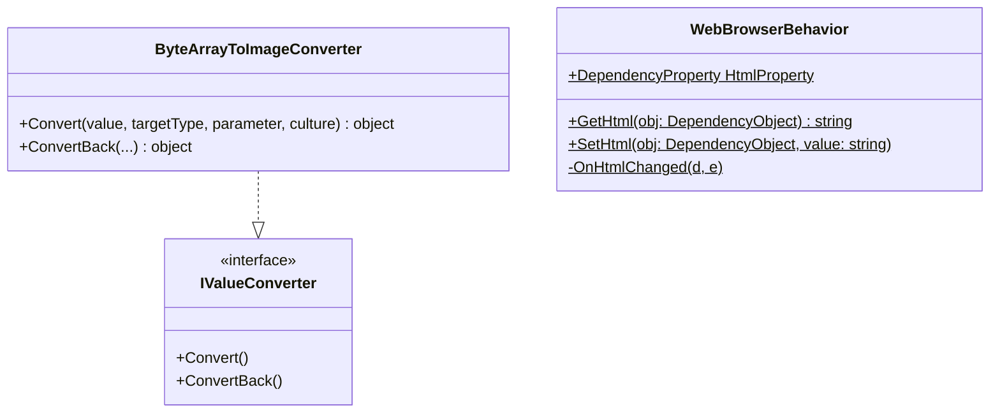

# 📚 Libraria: WPF Desktop Book Manager — MVVM & Repository Architecture

<p align="center">
  
  
  
  
  
</p>

## 📖 Overview

**Libraria** is a desktop application for managing a personal book collection, built with **WPF (.NET 8)** and a strict **MVVM architecture**. The project implements a clean separation between the data model, business logic, and UI layer — ensuring full testability and scalability.

The data persistence layer is based on a **file repository pattern** using JSON serialization. Books are stored in user-defined `.json` files that can be created, shared, and opened across sessions. The interface supports full **CRUD operations**, cover image management, reading progress tracking, star rating, genre tagging, and an integrated reader view for linked PDF/ebook files.

All UI interactions follow the **Command pattern** via `ICommand` bindings, and the application leverages **custom WPF UserControls** with **DependencyProperty** registration for reusable, data-bound components.

---

## 🏗️ Architectural Highlights

- **Model:** Plain C# classes (`Book`, `AppRepository`) with `INotifyPropertyChanged` support. Zero references to WPF or UI layer. Persistence handled by `AppRepository` using `System.Text.Json`.
- **ViewModel:** Derives from `BaseViewModel` which implements `INotifyPropertyChanged`. Each view has a dedicated ViewModel exposing `ICommand` properties and observable state. Navigation is managed by `MainViewModel` via a `CurrentPage` property.
- **View:** Pure XAML with no code-behind logic. Data binding connects Views to ViewModels entirely through `DataTemplate` mappings registered in `App.xaml`.
- **Custom Controls:** Reusable `UserControl` components (`RatingControl`, `TagControl`, `StatisticsBarControl`) expose `DependencyProperty` APIs and are fully composable via XAML binding.

---

## 🧩 Applied Patterns & Techniques

| Pattern / Technique | Implementation | Solved Problem |
| :--- | :--- | :--- |
| **MVVM** | `BaseViewModel` → `BookListViewModel`, `BookDetailViewModel`, `ReaderViewModel` | Decouples UI from logic; enables testable ViewModels with zero WPF dependencies |
| **Repository** | `AppRepository` with `Create()` / `Load()` / `Save()` | Encapsulates all file I/O and collection management behind a single interface |
| **Command** | `RelayCommand` wrapping `Action<object>` | Binds all user interactions (add, edit, delete, rate) to ViewModel methods via `ICommand` |
| **Observer** | `ObservableCollection<Book>` + `INotifyPropertyChanged` | Automatic UI refresh on any model mutation without manual event wiring |
| **DataTemplate** | `App.xaml` maps ViewModel types to View types | Enables view-less navigation — `MainViewModel` switches pages by changing `CurrentPage` type |
| **Value Converter** | `ByteArrayToImageConverter` (`IValueConverter`) | Converts raw `byte[]` cover data to `BitmapImage` for display without polluting the ViewModel |
| **Attached Behavior** | `WebBrowserBehavior.HtmlProperty` | Enables MVVM-safe HTML binding for the `WebBrowser` control which does not natively support `Source` binding |
| **DependencyProperty** | `RatingControl`, `TagControl` | Allows custom controls to participate in WPF data binding, animations, and style triggers |

---

## 🚀 Key Features

<details>
<summary><strong>MVVM Navigation & Shell</strong></summary>

`MainViewModel` acts as an application shell. It exposes a `CurrentPage` property of type `BaseViewModel`. Switching pages (Welcome → BookList → BookDetail → Reader) is done by assigning a new ViewModel instance — the corresponding View is resolved automatically via `DataTemplate` mappings registered in `App.xaml` and `MainWindow.xaml`.


</details>

<details>
<summary><strong>Repository & Data Model</strong></summary>

`AppRepository` is the single source of truth for all book data. It manages an `ObservableCollection<Book>` and auto-saves to a JSON file whenever the collection or any book's property changes. This is achieved by attaching `CollectionChanged` and `PropertyChanged` handlers during `Load()` and `AddBook()`.


</details>

<details>
<summary><strong>Custom WPF Controls</strong></summary>

Three reusable `UserControl` components are implemented with full `DependencyProperty` support, enabling them to participate in WPF data binding, styling, and animations.

**`RatingControl`** — An interactive 5-star rating widget. Supports hover preview (fills stars on mouse-over), click-to-rate, and a read-only display mode. Internally manages a `StarItem` collection with `INotifyPropertyChanged`, so the icon character (`★` / `☆`) updates reactively without recreating the list.

**`TagControl`** — Displays a collection of string tags as removable pill-shaped chips using a `WrapPanel`. Supports read-only mode (hides the remove button via `DataTrigger`) and exposes `RemoveTagCommand` as a `DependencyProperty`.

**`StatisticsBarControl`** — A slim status bar docked at the bottom of the main window. Binds to `StatisticsViewModel` to display live-updated aggregate data: total books, read/reading count, average rating, and most popular genre.


</details>

<details>
<summary><strong>Value Converters & Attached Behaviors</strong></summary>

**`ByteArrayToImageConverter`** — Implements `IValueConverter` to convert `byte[]` (stored in the `Book` model) into a WPF `BitmapImage`. The conversion uses a `MemoryStream` with `BitmapCacheOption.OnLoad` to avoid file handle retention. Registered as a global resource and referenced directly in XAML bindings.

**`WebBrowserBehavior`** — An attached property that enables binding HTML strings to the legacy `WebBrowser` control. Since `WebBrowser.Source` does not support standard `{Binding}` syntax, this behavior exposes an attached `Html` property. When the value changes, it calls `browser.NavigateToString()`, keeping the ViewModel's HTML content fully separated from the View.


</details>

---

## 🗂️ Project Structure

```
BookEditor/
├── Models/
│   ├── Book.cs                  # Core entity with INotifyPropertyChanged
│   └── AppRepository.cs         # JSON persistence & collection management
│
├── ViewModels/
│   ├── BaseViewModel.cs         # SetProperty + INotifyPropertyChanged base
│   ├── MainViewModel.cs         # Shell: navigation + repository wiring
│   ├── WelcomeViewModel.cs      # Entry screen commands
│   ├── BookListViewModel.cs     # List, filtering, selection, CRUD commands
│   ├── BookDetailViewModel.cs   # Add/Edit form with tag and cover management
│   ├── ReaderViewModel.cs       # In-app reader with page navigation
│   ├── StatisticsViewModel.cs   # Aggregate stats computed from repository
│   └── RelayCommand.cs          # Generic ICommand implementation
│
├── Views/
│   ├── WelcomeView.xaml         # Landing screen
│   ├── BookListView.xaml        # Main library grid/list
│   ├── BookDetailView.xaml      # Add/Edit book dialog
│   └── ReaderView.xaml          # Ebook reader panel
│
├── Controls/
│   ├── RatingControl.xaml/.cs   # Reusable star rating widget
│   ├── TagControl.xaml/.cs      # Tag chip list with remove support
│   └── StatisticsBarControl.xaml/.cs  # Bottom status bar
│
├── Converters/
│   └── ByteArrayToImageConverter.cs   # byte[] → BitmapImage
│
├── Helpers/
│   └── WebBrowserBehavior.cs    # Attached HTML binding for WebBrowser
│
├── App.xaml                     # Global resources, DataTemplate mappings
└── MainWindow.xaml              # Shell layout: menu, header, content area
```

---

## 🔧 Technical Setup

**System Requirements:**
- .NET SDK 8.0+
- Windows (WPF is Windows-only)
- Visual Studio 2022 or `dotnet` CLI

**Running the Application:**

```bash
dotnet run --project BookEditor
```

Or open `BookEditor.sln` in Visual Studio and press **F5**.

**First Launch:**
1. Click **Create Repository** to create a new `.json` library file.
2. Use the **Book → Add...** menu item or toolbar button to add your first book.
3. Attach a cover image, set reading status, add genre tags, and rate the book.
4. All changes are auto-saved to the repository file instantly.

---

*Developed as a project for Object-Oriented Programming (Warsaw University of Technology).*
